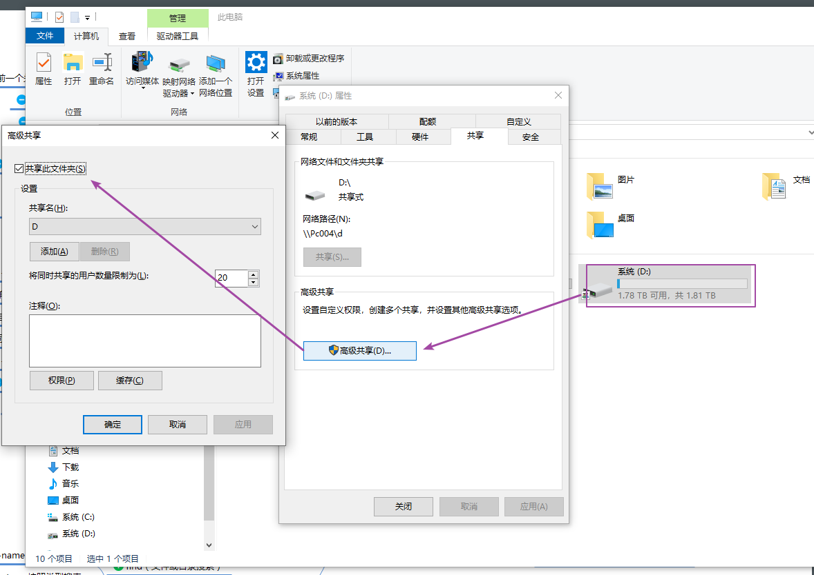
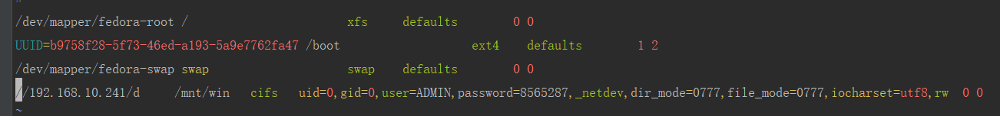

# VM虚拟机 与win10 共享文件

# 1. 设置需要共享的文件夹权限



# 2. liunx配置
安装CIFS工具
```
sudo apt-get install cifs-utils
```

编辑文件:  
```
vim /etc/fstab
```
文件内容

```redshift
/dev/mapper/fedora-root /                       xfs     defaults        0 0
UUID=b9758f28-5f73-46ed-a193-5a9e7762fa47 /boot                   ext4    defaults        1 2
/dev/mapper/fedora-swap swap                    swap    defaults        0 0
//192.168.10.241/d     /mnt/win   cifs   uid=0,gid=0,user=ADMIN,password=8565287,_netdev,dir_mode=0777,file_mode=0777,iocharset=utf8,rw  0 0  
```

执行命令
```
mount -a
```


##  或者直接执行命令

- username: win10的登陆账号
- password: win10的登陆密码
- rw:读写权限
- //192.168.10.241/D: 是w10的ip/文件目录
- /mnt/win  liunx 的目录

```redshift
mount -t cifs -o username=ADMIN,password=8565287,dir_mode=0777,file_mode=0777,iocharset=utf8,rw //192.168.10.241/D /mnt/win
```


